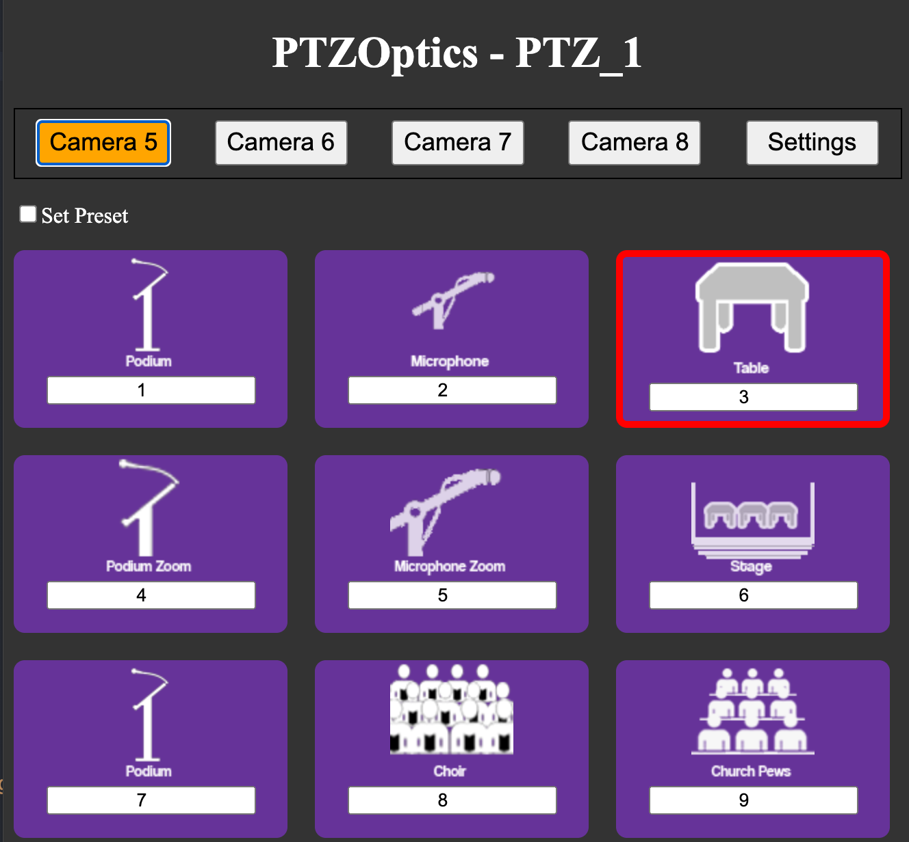

# PTZOptics OBS Plugin Browser Dock

This OBS plugin is a custom browser dock written in html and JavaScript. It was tested with OBS 27.1.3 on MacOS 12.1.

Preview:
https://boxhagen-stralau.github.io/PTZ_1

Select button with Camera 5, 6, 7 or 8.

Recall or set a preset on a camera.
- Click on an image to recall a preset.
- Set the checkbox "Set Preset" first, then click on an image. This stores a new preset and stores the selected image preset.



Select button Settings.
- Optional: enter PTZOptics Name that is displayed in the header.

For each camera 5, 6, 7 and 8.
- Camera IP Address (starting with localhost:8080/ip when using proxy)
- Start preset, for example 10. Presets are in range 1 to 89 or 100 to 254.
- The Presets that are used based on the start value, for example 10 - 18.


## Installing the Plugin

Download the files from github and unzip in a directory.

https://github.com/boxhagen-stralau/obs-plugin/archive/main.zip

In OBS select Docks > Custom Browser Docks. In URL enter the path to the plugin index.html starting with `file:///`.

Note: Create multiple Browser Docks with different directories `PTZ_1`, `PTZ_2`,`...` if using multiple users. This allows multiple users to store their own Presets without overwriting other users settings. For this to work, every user must select a different start value for the Presets, for example the first user with the `PTZ_1` has start value 10 and the second user with `PTZ_2` has start value 20.

## The browser dock uses http-cgi commands

The browser dock uses the follwing http-cgi commands to set and recall a preset with `action`:
- `posset` set preset on `[position number]`
- `poscall` recall preset on `[position number]`

The `[position number]` has a value in the range from 1 to 89 or from 100 to 254.

```
http://[camera ip]/cgi-bin/ptzctrl.cgi?ptzcmd&[action]&[position number]
```

Reference:
https://ptzoptics.com/developer-portal/

HTTP-CGI Control

## Add proxy

The plugin requires a local proxy running to forward all requests to the the cameras. This is a security restriction within all browsers because the plugin runs on localhost.

- On macOS copy the `Proxy.App` from the `proxy` directory to `/Applications`. 
- Download the `proxy-darwin-amd64` binary and copy to `/Applications/Proxy.app/Contents/MacOS` directory
- Run `chmod +x /Applications/Proxy.app/Contents/MacOS/proxy-darwin-amd64` in Terminal to make `proxy-darwin-amd64` executable
- In OBS add the `proxy.lua` to scripts

## Troubleshooting

Start OBS with parameter `--remote-debugging-port=9222`

```
/Applications/OBS.app/Contents/MacOS/obs --remote-debugging-port=9222
```

and open Chrome browser on `http://localhost:9222`
